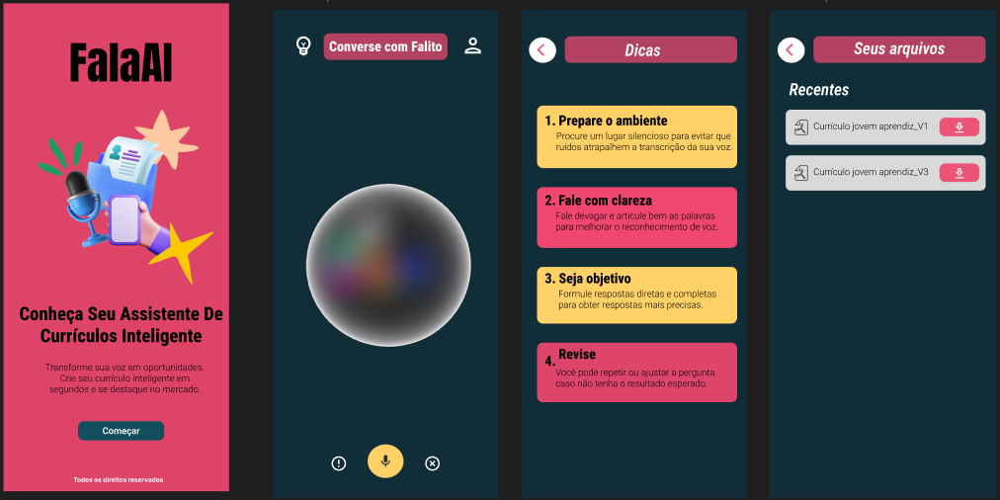

# Especificação do Trabalho de Conclusão de Curso

Pré-requisitos: <a href="2-TrabalhosRelacionados.md"> Trabalhos Relacionados</a>

> Nesta seção, são detalhadas as especificações do projeto desenvolvido, a partir da análise dos trabalhos relacionados. Apresenta-se uma visão geral das decisões técnicas adotadas, abrangendo desde a definição dos requisitos funcionais e não funcionais até a prototipação do sistema.

## Título que especifica o TCC
> Aplicação de Inteligência Artificial na Construção de Currículos com Comandos de voz para Jovens

## Requisitos Funcionais e Não Funcionais

A partir da fundamentação teórica e das etapas de desenvolvimento, foram definidos e
analisados os requisitos funcionais e não fundacionais que compõe a estrutura do sistema a ser desenvolvido.

|ID    | Descrição do Requisito  | Prioridade |
|------|-----------------------------------------|----|
|RF-001| O usuário deve poder gravar sua voz diretamente no app. | ALTA | 
|RF-002| O áudio deve ser convertido para texto utilizando uma API de IA para o reconhecimento de fala  | ALTA |
|RF-003| O texto transcrito será formatado para criação de um currículo. | ALTA |
|RF-004| O app gerará um arquivo PDF a partir do texto processado | ALTA |
|RF-005| O app deve armazenar os currículos gerados localmente no dispositivo. | MÉDIA|
|RF-006| app deve permitir navegação entre as telas. | MÉDIA|

*Fonte: Elaborado pelo autor (2025)*

---

|ID     | Descrição do Requisito  |Prioridade |
|-------|-------------------------|----|
|RNF-001| O app deve ser rápido, especialmente na transcrição do áudio e geração do PDF.|  ALTA| 
|RNF-002| O app deve ser compatível com dispositivos Android e iOS, responsivo em diferentes telas. |  ALTA | 
|RNF-003| A interface deve ser intuitiva e simples, com feedbacks visuais e sonoros. |  ALTA | 
|RNF-004| Dados sensíveis devem ser armazenados de forma segura no dispositivo.|  ALTA | 
|RNF-005| A arquitetura do app deve permitir fácil expansão no futuro|  MÉDIA | 

*Fonte: Elaborado pelo autor (2025)*

## Protótipos do Sistema

A partir da definição dos requisitos do sistema e das funcionalidades, iniciou-se a etapa de prototipação das interfaces, visando estruturar a lógica de navegação e definir a disposição dos elementos visuais.

*Fonte: Elaborado pelo autor (2025)*

[Próximo](./4-Metodologia.md)
